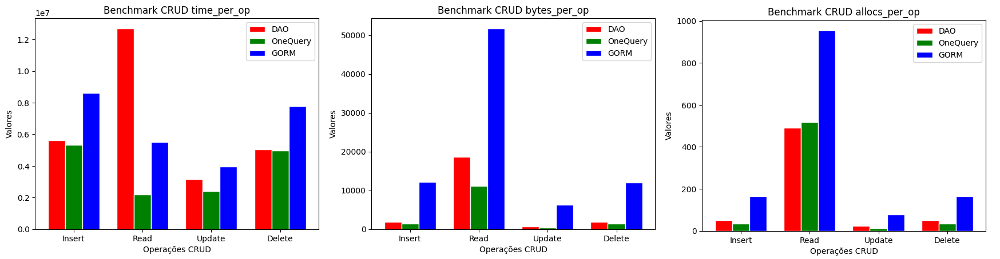

# Estudo comparativo de desempenho de acesso a banco de dados em Golang

🌍 *[**Português**](README.md) ∙ [English](README_en.md)*

## Descrição
Este projeto explora diferentes métodos de acesso a dados em um banco de dados PostgreSQL usando Go. Foram implementados e testados três abordagens diferentes para ler dados: uma consulta SQL única, múltiplas consultas CRUD DAO gerenciadas com reflexão e o ORM GORM.

### Implementações

- [OneQuery](./go-projects/tests/ClassOneQuery/repository/repository.go): Para esta abordagem implementamos os médodos de acesso ao banco de dados com comandos SQL escritos diretamente no código. Os parâmetros de entrada são passados separadamente para a biblioteca padrão sql, isto evita SQL Injection.

- [DAO](./go-projects/tests/ClassDAO/dao/dao.go): Para esta abordagem os comandos SQL são construídos de forma genérica e utilizando reflexão. Nesta abordagem utilizamos tags para indicar os nomes das colunas no banco de dados.

- [ORM](./go-projects/tests/ClassWithGorm/repository/repository.go): Para esta abordagem utilizamos um dos ORMs mais famosos para Go o Gorm. A implementação foi feita seguindo as especificações deste framework.

## Ambiente de Teste

Para facilitar a preparação do ambiente, utilizamos o PostgreSQL em um container Docker. Enquanto o projeto go foi organizado com cada teste no diretório de `tests`. Os detalhes destas partes são delhados nos arquivos:
- [README go](./go-projects/README.md)
- [README db](./database/README.md)

## Resultados dos Benchmarks

O ambiente utilizado nos testes tem as seguintes características:
- **Sistema Operacional**: Windows
- **Arquitetura do CPU**: AMD64
- **CPU**: Intel(R) Core(TM) i7-10510U @ 1.80GHz
- **Banco de Dados**: PostgreSQL

---

### Testes Iniciais apenas de Leitura

#### 1. Leitura com Consulta SQL Única
```
Pacote: m/tests/ReadClassOneQuery
Execuções: 
- 660 execuções: 1876615 ns/op, 11064 B/op, 517 allocs/op
- 771 execuções: 1436036 ns/op, 11066 B/op, 517 allocs/op
- 387 execuções: 3240193 ns/op, 11064 B/op, 517 allocs/op
```

#### 2. Leitura com DAO implementado com reflexão
```
Pacote: m/tests/ReadClassWithCrud
Execuções:
- 96 execuções: 12052747 ns/op, 18664 B/op, 491 allocs/op
- 100 execuções: 10449300 ns/op, 18668 B/op, 491 allocs/op
- 82 execuções: 15597262 ns/op, 18661 B/op, 491 allocs/op
```

#### 3. Leitura com GORM
```
Pacote: m/tests/ReadClassWithGorm
Execuções:
- 298 execuções: 4154921 ns/op, 51744 B/op, 955 allocs/op
- 188 execuções: 6620905 ns/op, 51794 B/op, 957 allocs/op
- 196 execuções: 5753415 ns/op, 51777 B/op, 957 allocs/op
```
---

### Testes com CRUD

No subdiretódio `cmd` implementamos um programa que executa todos os testes completos com benchmark. Este programa registra os resultados em um arquivo `benchmark_results.log`. Para executar, no diretório `go-projects` execute o comando:

```sh
go run cmd/main.go
```

### Resultados

Utilizando o progama indicado no tópico anterior foram executadas algumas rodadas de testes, em seguida os resultados foram separados e realizadas as médias. O resultado final pode ser observado na seguinte figura:



O gráfico apresenta o desempenho em nanosegundos por operação (ns/op), o uso de memória em bytes por operação (B/op), e o número de alocações de memória por operação (allocs/op), oferecendo uma visão abrangente da eficiência de cada abordagem testada.


---

## Conclusão
Os benchmarks revelam diferenças significativas no desempenho e no uso de recursos entre as três abordagens testadas. A leitura com consulta SQL única, conforme esperado, é a abordagem mais eficiente. Embora em termos de alocação de recursos a implementação com DAO para este exemplo obteve uma alocação de memória comparável com a consulta única. Por fim, a abordagem com GORM, apesar de ser a mais prática em termos de desenvolvimento, resultou em maior tempo de execução e maior uso de recursos.
Durante a implementação, observamos também que o uso de transações pode piorar bastante a performance.

---

## Contribuições

Contribuições, correções e sujestões são bem-vindas.

## Licença

Este projeto está licenciado sob a [Licença MIT](LICENSE).
