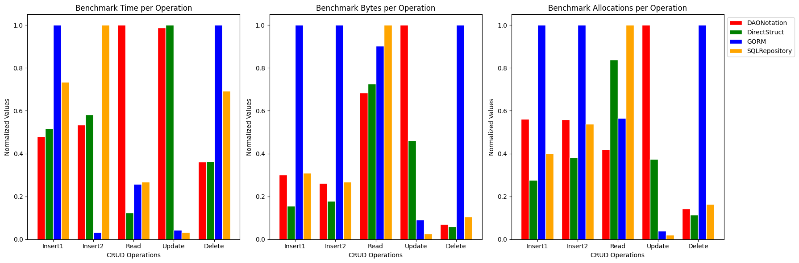

# Estudo Comparativo de Desempenho de Acesso a Banco de Dados em Golang

🌍 *[**Português**](README_pt.md) ∙ [English](README.md)*

## Descrição
Este projeto explora diferentes métodos de acesso a dados em um banco de dados PostgreSQL usando Go. Três abordagens distintas foram implementadas e testadas para leitura de dados: uma consulta SQL única, múltiplas consultas CRUD DAO gerenciadas com reflexão e o ORM GORM.

### Implementações das Estruturas

#### Notação DAO

Usa apenas declarações de estrutura com tags adicionais. A ideia principal desse DAO é a simplicidade, incluindo apenas tags que indicam os nomes das colunas no banco de dados.

```go
package entities

import "time"

type Project struct {
    ID          int       `db:"ID" json:"id"`
    Name        string    `db:"NAME" json:"name"`
    Manager     string    `db:"MANAGER" json:"manager"`
    StartDate   time.Time `db:"START_DATE" json:"startDate"`
    EndDate     *time.Time `db:"END_DATE" json:"endDate"`
    Budget      *float64  `db:"BUDGET" json:"budget"`
    Description *string   `db:"DESCRIPTION" json:"description"`
    Tasks       []Task    `json:"tasks"` // Tarefas associadas
}
```

#### Estrutura Direta (DirectStruct)

Nesta abordagem, apenas declaramos as estruturas sem tags adicionais.

#### GORM

Usa declarações de estrutura com tags adicionais. Neste caso, as tags podem ser complexas, pois devem descrever relações e definições do banco de dados.

#### SQLRepository

As entidades são declaradas como estruturas simples, mas devem implementar uma interface que define métodos de mapeamento para o banco de dados.

## Ambiente de Teste

Para facilitar a configuração, usamos PostgreSQL em um contêiner Docker. O projeto em Go foi organizado com cada teste no diretório `tests`. Detalhes desses componentes estão nos arquivos a seguir:
- [README Go](./go-projects/README.md)
- [README DB](./database/README.md)

## Resultados de Benchmark

O ambiente de teste tem as seguintes características:
- **Sistema Operacional**: Windows
- **Arquitetura da CPU**: AMD64
- **CPU**: Intel(R) Core(TM) i7-10510U @ 1.80GHz
- **Banco de Dados**: PostgreSQL

---

### Testes de CRUD

No subdiretório `cmd`, implementamos um programa que executa todos os testes de benchmark completos. Esse programa registra os resultados em um arquivo chamado `benchmark_results.log`. Para executá-lo, rode o comando a seguir no diretório `go-projects`:

```sh
go run cmd/main.go
```

### Resultados

Usando o programa mencionado, várias rodadas de teste foram executadas e os resultados foram calculados como média. O resultado final pode ser observado na tabela a seguir:

|    | Metodologia   | Operação        | Tempo por Op (ns) | Bytes por Op | Alocações por Op |
|----|---------------|-----------------|-------------------|--------------|------------------|
| 0  | DAONotation   | InsertResources | 1,095,199,700    | 1,342,200    | 36,377          |
| 1  | DAONotation   | InsertProject   | 6,619,269,900    | 3,434,856    | 84,948          |
| 2  | DAONotation   | ReadProject     | 736,151,200      | 6,382,984    | 109,964         |
| 3  | DAONotation   | UpdateProject   | 988,277,400      | 1,092,796    | 31,370          |
| 4  | DAONotation   | DeleteProject   | 11,452,412       | 4,342        | 103             |
| 5  | DirectStruct  | InsertResources | 1,183,314,100    | 698,448      | 17,853          |
| 6  | DirectStruct  | InsertProject   | 7,216,280,000    | 2,336,688    | 58,054          |
| 7  | DirectStruct  | ReadProject     | 91,569,631       | 6,757,562    | 220,025         |
| 8  | DirectStruct  | UpdateProject   | 1,000,177,050    | 503,960      | 11,732          |
| 9  | DirectStruct  | DeleteProject   | 11,524,834       | 3,705        | 83              |
| 10 | GORM          | InsertResources | 2,284,504,400    | 4,468,928    | 64,764          |
| 11 | GORM          | InsertProject   | 411,073,933      | 13,142,098   | 151,953         |
| 12 | GORM          | ReadProject     | 189,112,433      | 8,420,336    | 148,320         |
| 13 | GORM          | UpdateProject   | 42,444,254       | 99,141       | 1,235           |
| 14 | GORM          | DeleteProject   | 31,744,019       | 62,123       | 724             |
| 15 | SQLRepository | InsertResources | 1,678,694,100    | 1,384,672    | 25,985          |
| 16 | SQLRepository | InsertProject   | 12,395,136,800   | 3,521,720    | 81,748          |
| 17 | SQLRepository | ReadProject     | 196,602,150      | 9,319,502    | 262,171         |
| 18 | SQLRepository | UpdateProject   | 33,497,850       | 29,992       | 627             |
| 19 | SQLRepository | DeleteProject   | 21,979,775       | 6,534        | 118             |

A tabela apresenta o desempenho em nanosegundos por operação (ns/op), uso de memória em bytes por operação (B/op) e o número de alocações de memória por operação (allocs/op), oferecendo uma visão abrangente da eficiência de cada abordagem testada.

A figura abaixo mostra os resultados normalizados por gráfico de barras:



### Conclusões

Com base nos dados normalizados do experimento de benchmarking, podem-se tirar as seguintes conclusões sobre o desempenho das operações CRUD entre as diferentes metodologias (`DAONotation`, `DirectStruct`, `GORM` e `SQLRepository`):

**Desempenho de Tempo**

- O `GORM` demonstra uma ineficiência significativa de tempo em algumas operações, destacando-se em `InsertResources` e `DeleteProject`, mas apresentando baixa performance em `InsertProject` e `UpdateProject`.
- O `SQLRepository` mostra consistência com uma eficiência de tempo moderada, especialmente com operações como `UpdateProject`.

**Uso de Memória (Bytes)**

- O `GORM` exibe o maior consumo de memória em geral, com várias operações no valor máximo de 1.0.
- O `DAONotation` tem bom desempenho no uso de memória, com eficiência em operações como `DeleteProject`.
- O `SQLRepository` apresenta um perfil equilibrado de alocação de memória.

**Contagem de Alocações**

- O `GORM` tende a alocar mais recursos, o que reflete ineficiência nas alocações de recursos.
- O `DirectStruct` mantém uma boa eficiência nas alocações.
- O `SQLRepository` demonstra a melhor eficiência de alocação, especialmente em `UpdateProject`.

---

## Contribuições

Contribuições, correções e sugestões são bem-vindas.

## Licença

Este projeto está licenciado sob a [Licença MIT](LICENSE).