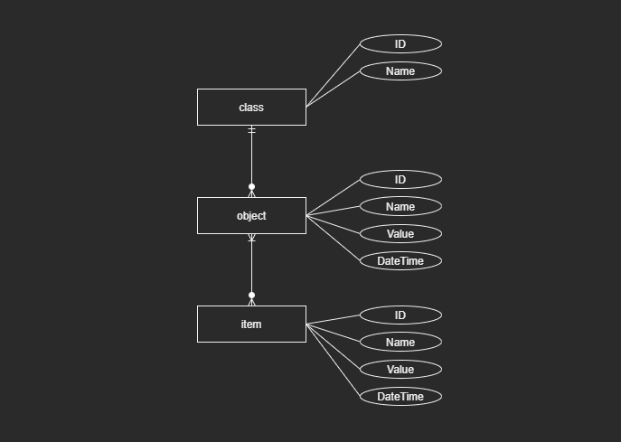

# Database Schema

🌍 *[**English**](README_en.md) ∙ [Português](README.md)*

In this directory, you will find the database schema used in the tests and experiments.

We have the following entities:



The main objective of this model is to test different types of data and `1-N` and `N-N` relationships.

See the table creation script [schema](schema.sql).

# Docker

To create a Docker container with the database, run the following commands in this directory:

```shell
docker build -t my-db-image .
```

```shell
docker run --name my-container-db -p 5432:5432 -d my-db-image
```

# Python Data Insertion Script

The script [data_insert](data_insert.py) can be used to generate data within the proposed structure. Note that it is possible to parameterize the amount of data to be inserted in this script.

To run the script, Python 3.12 must be installed.