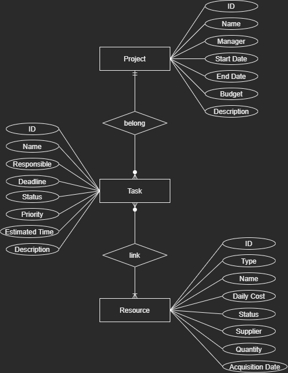

# Database Schema

🌍 *[**Português**](README_pt.md) ∙ [English](README.md)*

Neste diretório está o esquemático de banco de dados utilizado nos testes e experimentos.

Temos as seguintes entidades:



O principal objetivo deste modelo é testar diferentes tipos de dados e relacionamentos `1-N` e `N-N`.

Veja o script de criação das tabelas [schema](schema.sql).

# Docker

Para gerar um container Docker com o banco de dados execute neste diretório os seguintes comandos:

```shell
docker build -t my-db-image .
```

```shell
docker run --name my-container-db -p 5432:5432 -d my-db-image
```